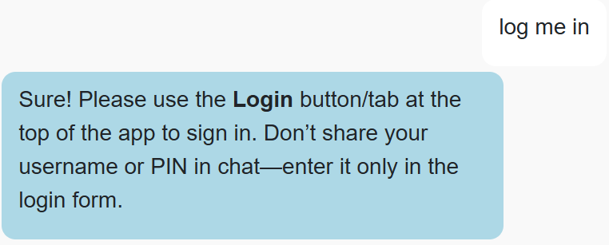
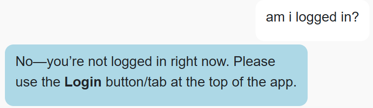
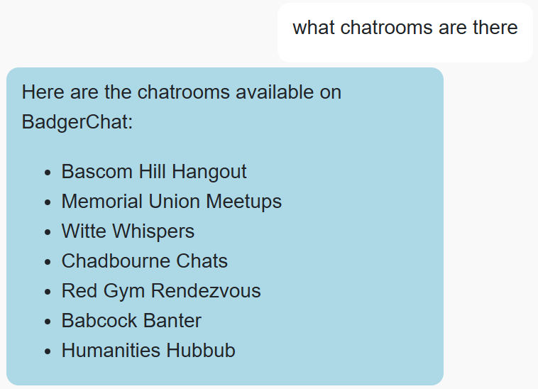
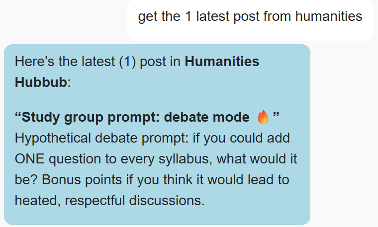
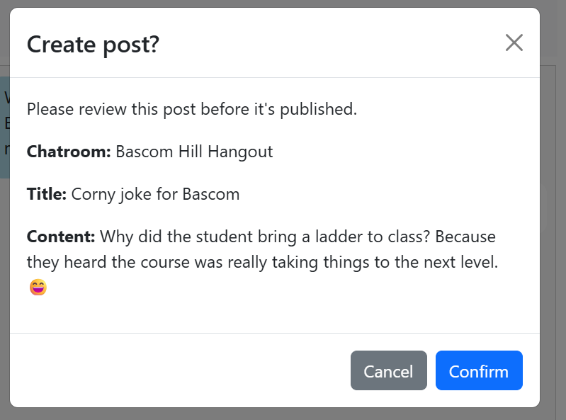

# CS571-S26 HW11: BadgerChat Agent (Bucky)

For this assignment, you will build **Bucky** — an AI agent that can interact with BadgerChat on behalf of the user. Bucky is built on top of the same BadgerChat API you used in HW6 and HW9, but instead of pushing buttons, the user talks to an assistant that decides which API calls to make. The UI (navbar, chat log, input field, and all four modals) is already wired up for you; your job is entirely focused on **tool calling** — defining the tools Bucky can use, and implementing the agent loop that drives them.

## Setup

You will complete this assignment using CS571's AI API, a wrapper around [OpenAI's GPT-5.4 nano](https://platform.openai.com/docs/models/gpt-5.4-nano), and CS571's BadgerChat API.

The starter code provided to you was generated using [vite](https://vitejs.dev/guide/). Furthermore, [bootstrap](https://www.npmjs.com/package/bootstrap), [react-bootstrap](https://www.npmjs.com/package/react-bootstrap), [react-markdown](https://www.npmjs.com/package/react-markdown), and [react-spinners](https://www.npmjs.com/package/react-spinners) have already been installed. In this directory, simply run...

```bash
npm install
npm run dev
```

Then, in a browser, open `localhost:5173`. You should *not* open index.html in a browser; React works differently than traditional web programming! When you save your changes, they appear in the browser automatically. I recommend using [Visual Studio Code](https://code.visualstudio.com/) to do your development work.

This assignment uses **two APIs**, documented in `AI_API_DOCUMENTATION.md` and `CHAT_API_DOCUMENTATION.md` Every request must include a valid `X-CS571-ID` header.

## Special Notes
 - The starter code and file structure are a suggestion. You are welcome to move, add, or remove snippets of code as you see fit.
 - I'd recommend, though not require, following the `src/tools/` design pattern that we developed in our in-class exercise.
 - Each of your tool handlers may simply return the data for the model to reason about its response.
   - e.g. `get_messages` may simply return a stringified list of messages as its `function_call_output` for the model to display as it chooses.
 - You do *not* need to handle `413` (context too long) or `429` (too many requests) errors from the AI API.
 - Feel free to modify the developer prompt (`DEV_PROMPT` in `TextApp.jsx`) as you see fit; it initially assumes all tools are available and implemented (which they will be at the end of this HW!)
 - There is no requirement to delete a post for this HW; in fact, the API doesn't support it!

### 1. Login, Register, and Logout

Logging in, registering, and logging out are already implemented as UI controls — the Login, Register, and Logout buttons in the navbar open the corresponding modals. Because these flows involve a user's credentials, Bucky should **never** attempt to collect them over chat. Instead, Bucky's tools for these actions simply return a message telling the user to click the appropriate button.

For each of these intents, create a tool that simply tells informs the agent to use corresponding UI controls rather than attempting credential collection in chat. You may find our in-class exercise helpful here.



### 2. `whoami`

Bucky may need to know whether the user is logged in — for example, before attempting to create a post on their behalf. Add a `whoami` tool that takes no parameters and calls `GET https://cs571api.cs.wisc.edu/rest/s26/hw11/chat/whoami`.

You may simply return the stringified response from your handler; the model will reason about it.



### 3. `get_chatrooms`

Add a `get_chatrooms` tool, taking no parameters, that calls `GET https://cs571api.cs.wisc.edu/rest/s26/hw11/chat/chatrooms` and returns the array of chatroom names. You may simply return the stringified response from your handler; the model will reason about it.



### 4. `get_messages`

Add a `get_messages` tool that fetches recent posts. **Note that the API has changed from HW6 and HW9!**

 - The `chatroom` query parameter is now **optional**. If specified, the endpoint returns the 10 most recent messages in that chatroom; if omitted, it returns the 10 most recent messages across *all* chatrooms in one response.
 - The endpoint returns **up to 10 messages** per request (previously it returned 25 per page with pagination). There is no `page` parameter anymore.

**Parameters:**
 - `chatroom` *(optional, string and enum)* — case-sensitive chatroom name; must be specified as an `enum`! If omitted, return latest posts across all chatrooms.
 - `n` *(optional, integer 1–10)* — maximum number of posts to return. The underlying API already caps the response at 10, so anything larger should be silently truncated to 10 in your tool as well.

You may simply return the stringified response from your handler; the model will reason about it.



### 5. `create_post` (with a confirmation modal)

Creating a post must be gated behind an explicit confirmation. A `ConfirmModal` component already exists in `src/components/modals/ConfirmModal.jsx` — it takes `show`, `post`, and `onClose` props and displays the proposed chatroom / title / content before letting the user Confirm or Cancel.

**Tool behavior** — add a `create_post` tool with these parameters:
 - `chatroom` *(required, string and enum)* — case-sensitive chatroom name; must be specified as an `enum`!
 - `title` *(required, string)* — title of the post
 - `content` *(required, string)* — body of the post



### Other Notes
You should now be able to interact with BadgerChat through the web (HW6), your phone (HW9), and an AI agent (HW11)! 🥳

### Submission Details
In addition to your code, **you will also need to submit a video recording of your app**. Like the demo video, it should cover all the tasks below. Please thoroughly demonstrate all tasks to showcase the capabilities of your app.

**Please embed your recording as a Kaltura video as a part of the assignment submission.**

#### Tasks 
 1. Ask for a list of chatrooms.
 2. Ask to register (should be redirected to the UI controls).
 3. Register for an account using the UI controls.
 4. Create a post in some chatroom; specify the title, content, and chatroom yourself.
 5. Confirm the post creation using the modal.
 6. Get the 3 latest posts in the chatroom you just created a post in.
 7. Ask to logout (should be redirected to the UI controls).
 8. Logout via the UI controls.
 9. Get the latest messages across all chatrooms.
 10. Ask to login (should be redirected to the UI controls).
 11. Login using the UI controls.
 12. Ask to create a post of the model's choosing title, content, and chatroom.
 13. Confirm the post creation using the modal.
 14. Ask for the 5 latest post across all chatrooms.
 15. Say "Thanks for a great semester Bucky!" or something similar; you're all done! :)

